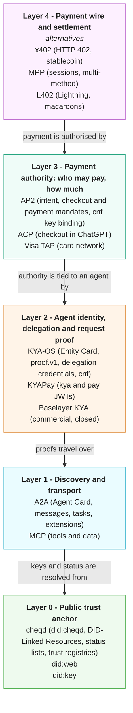
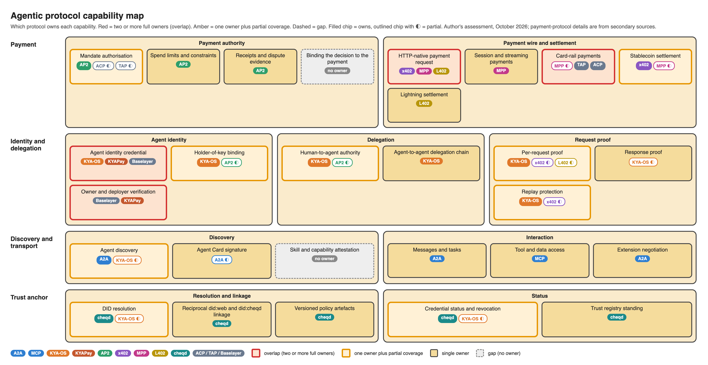
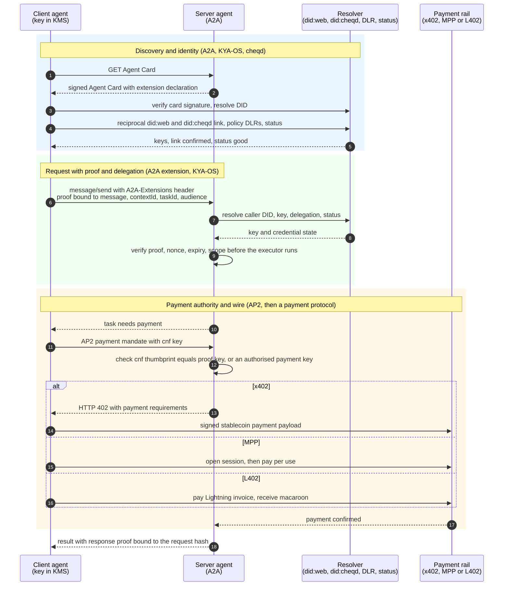

# Agentic protocol stack — capability map and composed flow

> **Working diagrams, not a specification.** The capability ratings are this author's assessment from public specifications and the research in [landscape-2026-10.md](./landscape-2026-10.md). The composed flow includes steps that exist only as a draft proposal and are marked as such. Payment-protocol details were taken from secondary sources and are *unverified*.

## 1. Capability map

Five layers, with the trust anchor underneath. Protocols at the same layer are alternatives or complements. They are not stacked on one another.

### Capability map with overlaps and gaps

Each box is one capability. Chips show which protocols cover it: filled means the protocol owns it, outlined with ◐ means partial. Red boxes have two or more full owners (real overlap). Amber boxes have one owner plus partial coverage. Dashed boxes have no owner.

The ratings are data in [`tools/capability-map/generate.py`](./tools/capability-map/generate.py). Edit them and regenerate rather than redrawing the image; see its [README](./tools/capability-map/README.md).

Counts: 28 capabilities, of which 4 overlap, 9 have partial overlap, 2 are gaps and 13 have a single owner.

| Kind | Capabilities |
|---|---|
| Overlap (two or more full owners) | HTTP-native payment request (x402, MPP, L402); card-rail payments (TAP, ACP, with MPP partial); agent identity credential (KYA-OS, KYAPay, Baselayer); owner and deployer verification (Baselayer, KYAPay) |
| Partial overlap | Mandate authorisation; stablecoin settlement; holder-of-key binding; human-to-agent authority; per-request proof; replay protection; agent discovery; DID resolution; credential status and revocation |
| Gap | Binding the decision to the payment; skill and capability attestation |

### Capability matrix

● owns the capability  ◐ partial  ○ none

| Capability | A2A | KYA-OS | AP2 | x402 | MPP | L402 | cheqd |
|---|---|---|---|---|---|---|---|
| Agent discovery | ● | ◐ (Entity Card) | ○ | ○ | ◐ | ○ | ○ |
| Message and task transport | ● | ○ | ○ | ○ | ◐ | ○ | ○ |
| Agent identity | ◐ (signed card, no key trust model) | ● | ◐ (key binding only) | ○ | ◐ | ○ | ● (anchor) |
| Delegated authority | ○ (multi-hop identity loss) | ● | ◐ (agent-to-agent out of scope) | ○ | ○ | ○ | ○ |
| Per-request proof | ○ | ● | ○ | ◐ (payment signature) | ◐ | ◐ (macaroon) | ○ |
| Payment authority | ○ | ○ | ● | ○ | ◐ | ○ | ○ |
| Payment wire | ○ | ○ | ○ | ● | ● | ● | ○ |
| Settlement | ○ | ○ | ○ | ● (USDC on-chain) | ◐ (cards and stablecoin) | ● (Lightning) | ○ |
| Revocation and status | ○ | ● | ◐ | ○ | ○ | ○ | ● |

Reading the matrix:

- **A2A and KYA-OS are complementary.** A2A carries the interaction. KYA-OS supplies what A2ABreak found missing: key trust, delegation and request proof.
- **AP2 and x402 sit at different layers.** AP2 says whether an agent may pay. x402 is one way the payment travels. They are not rivals.
- **x402, MPP and L402 compete** at layer 4. MPP is reported to accept x402 as one of its payment methods, so the two also overlap.
- **cheqd is not a protocol in this stack.** It supplies durable, independently resolvable identity and status that layers 1 to 3 can reference.
- **Gaps:** nothing here ties the signed *decision* to the payment. The AP2 whisper-attack paper reports this gap, and key binding does not close it.

## 2. Composed flow

One agent calling a paid service. The table after the diagram says which steps rest on existing mechanisms and which on draft proposals.

### What each step relies on

| Steps | Mechanism | Status |
|---|---|---|
| 1-5 | A2A Agent Card signing, KYA-OS Entity Card, cheqd resolution and status | Card signing is in A2A. Resolver and linkage are proposed in the draft specification |
| 6-9 | `A2A-Extensions` negotiation, `org.kya-os/proof.v1`, verification order | Header is in A2A. The A2A binding is a draft proposal |
| 10-12 | AP2 mandate, `cnf` thumbprint rule | Mandate is in AP2 v0.2.0. The thumbprint rule is a draft proposal |
| 13-17 | Payment protocols | Described in secondary sources only. How AP2 composes with each is unverified |
| 18 | Response proof | Draft proposal |

### Limits of this flow

- **Order of the payment steps is illustrative.** Real AP2 flows differ for human-present and autonomous cases.
- **Streaming, push notifications and non-JSON-RPC transports** are not shown, and are out of scope for the draft v1.
- **The whisper-attack risk is not mitigated here.** Nothing in this flow verifies the decision that produced the mandate.
